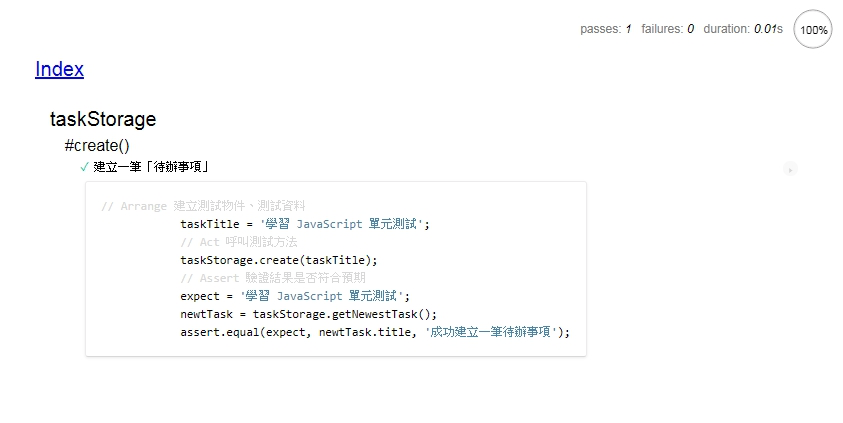

## 前端測試環境

雖然 JavaScript 的測試環境有**區分前端、後端**，但是 Mocha 有提供前端測試環境用的 mocha.js 供大家使用。

**但是**`由於 mocha 並沒有支援前端測試的斷言庫`，
所以加入 [chia](http://www.chaijs.com/) 斷言庫進行斷言。

### 建置環境

為了區隔前端與後端的測試程式，在 tests 目錄底下再新增一個 front 目錄：

```
mkdir tests/front
```

接下來在 tests/front 建立一個建置測試環境的 HTML，

再依序載入 mocha.js、chai.js、受測物件、測試程式即可。

#### 詳細請看 test_taskStorage.html：

```html
<!DOCTYPE html>
<html>
    <head>
        <meta charset="utf-8">
        <title>Cow tests</title>
        <link rel="stylesheet" media="all" href="../../node_modules/mocha/mocha.css">
    </head>
    <body>
        <div id="mocha"><p><a href=".">Index</a></p></div>
        <div id="messages"></div>
        <div id="fixtures"></div>
        <script src="../../node_modules/mocha/mocha.js"></script><!-- mocha 前端測試框架 -->
        <script src="../../node_modules/chai/chai.js"></script>  <!-- chia 斷言庫 -->
        <script src="../../assets/js/taskStorage.js"></script>   <!-- 受測物件    -->
        <script>mocha.setup('bdd')</script>
        <script src="test_taskStorage.js"></script>              <!-- 測試程式    -->
        <script>mocha.run();</script>
    </body>
</html>
```

#### 測試程式: test_taskStorage.js：
```javascript
var assert = chai.assert;        // 將 assert 替換成 chai.assert 

describe('taskStorage', function() {
    describe('#create()', function() {
        it('建立一筆「待辦事項」', function() {

            // Arrange 建立測試物件、測試資料
            taskTitle = '學習 JavaScript 單元測試';

            // Act 呼叫測試方法
            taskStorage.create(taskTitle);

            // Assert 驗證結果是否符合預期
            expect = '學習 JavaScript 單元測試';

            newtTask = taskStorage.getNewestTask();

            assert.equal(expect, newtTask.title, '成功建立一筆待辦事項');
        });
    });
});
```

#### 瀏覽器執行 test_taskStorage.html 測試結果：


建置前端測試環境成功～ LOL


