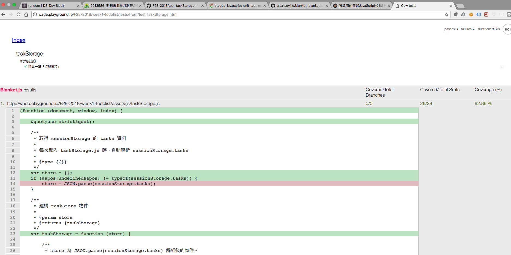

## 前端測試覆蓋率

要取得 JavaScript 的`測試覆蓋率`必須另外安裝套件，並且也`有區分前端、後端`。

目前得知比較熱門的測試覆蓋率套件為：

#### 後端：

  * [istanbul](https://istanbul.js.org/)

#### 前端：

  * [Blanket.js](https://github.com/alex-seville/blanket)

##### 注意：

前端覆蓋率套件 Blanket.js 已經失修。有機會要找新的套件取代。

### 前端測試覆蓋率

----

[Blanket.js](https://github.com/alex-seville/blanket)是一款易於安裝，易於配置且易於使用的 JavaScript 程式覆蓋率庫，可在瀏覽器中和與 Node.js一起使用。

除此之外也是唯一找到可以與 Mocha 前端測試搭配的套件。

Blanket.js 的使用非常簡單，只需要兩個步驟即可。

#### 一、將 Blanket.js 添加到您的 HTML 測試文件：
```html
<script src="...path/blanket.js"
        data-cover-adapter="...path/mocha-blanket.js"></script>
```

##### 注意：

mocha-blanket.js 是讓 blanket.js 可以在 mocha 測試之後產生覆蓋率的匹配器。

原始碼文件：[blanket.js](https://raw.github.com/alex-seville/blanket/master/dist/qunit/blanket.min.js)， [mocha-blanket.js](https://raw.github.com/alex-seville/blanket/master/src/adapters/mocha-blanket.js)

#### 二、在受測物件的 \<script> 標籤加入 data-cover 屬性
```html
  <script src="../../assets/js/taskStorage.js" data-cover></script> <!-- 添加 data-cover 屬性 -->
```

#### test_taskStorage.html 配置完成的樣子
```html
<!DOCTYPE html>
<html>
<head>
  <meta charset="utf-8">
  <title>Cow tests</title>
  <link rel="stylesheet" media="all" href="../../node_modules/mocha/mocha.css">
</head>
<body>
  <div id="mocha"><p><a href=".">Index</a></p></div>
  <div id="messages"></div>
  <div id="fixtures"></div>
  <script src="../../node_modules/mocha/mocha.js"></script>
  <script src="blanket.min.js" data-cover-flags="branchTracking"  data-cover-adapter="mocha-blanket.js"></script>
  <script src="../../node_modules/chai/chai.js"></script>
  <script src="../../assets/js/taskStorage.js" data-cover></script>
  <script>mocha.setup('bdd')</script>
  <script src="test_taskStorage.js"></script>
  <script>mocha.run();</script>
</body>
</html>
```

#### 配置完成，執行 test_taskStorage.html 就會自動產生測試涵蓋率的區塊：



參考文章：

* [前端 mocha + blanket 產生測試覆蓋率](https://nicolas.perriault.net/code/2013/get-your-frontend-javascript-code-covered/)：


