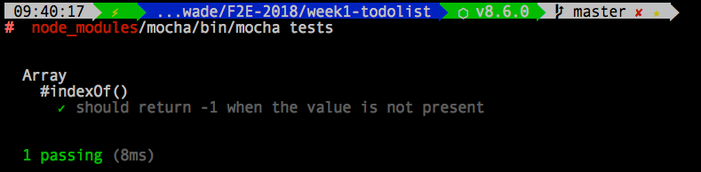
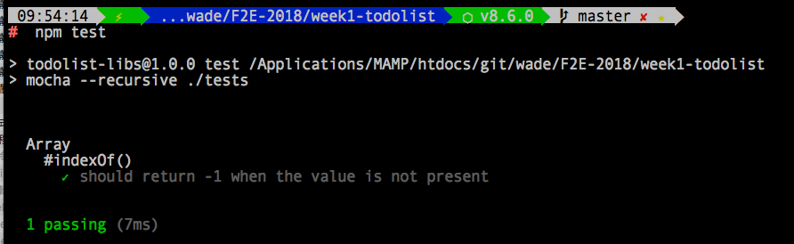

# 建立單元測試環境

本案例使用 [Mocha 單元測試框架](https://mochajs.org/)替專案進行測試。

## GETTING STARTED

### 安裝 mocha
```
$ cd 到專案根目錄
$ npm install mocha
```

### 建立測試目錄與測試程式

```
$ mkdir tests          # 建立測試目錄
$ $EDITOR test/test.js # 在測試目錄下，使用你的編輯器建立測試程式 test.js
```

到目前為止，專案目錄結構如下：

```
├── index.html
├── node_modules           # node 套件目錄
│   │ 
│   ├── mocha              # mocha 目錄
│   │   ├── bin            # mocha 執行檔目錄
│   │   │   ├── mocha      # mocha 執行檔，我們就是透過這個 mocha 進行單元測試
├── package-lock.json
├── package.json
└── tests                  # 測試目錄，以後所有測試程式統一放在 tests 目錄下
    └── test.js            # 測試程式 test.js
```

### 確定測試環境已經建立

進行測試之前，一定要先確定測試環境已經建立完成，所以先隨便寫一個一定會 pass 的測試程式。

** 編輯 test.js **
```javascript
var assert = require('assert');
describe('Array', function() {
  describe('#indexOf()', function() {
    it('should return -1 when the value is not present', function() {
      assert.equal([1,2,3].indexOf(4), -1);
    });
  });
});
```

### 手動進行第一次測試
啟用 Mocha，第一個參數必須是`測試目錄的路徑`
```
$ node_modules/mocha/bin/mocha tests
```
#### 執行結果：


### 透過 npm 進行測試

如果覺得每次都要打這麼長的指令才能進行測試，也可以設定 package.json，使用 npm 進行測試。

在 package.json 的 scripts 欄位加入 `"test": "mocha --recursive ./tests" `。

** 修改 package.json **
```
{
  "name": "todolist-libs",
  "version": "1.0.0",
  "description": "todolist-libs",
  "main": "index.js",
  "scripts": {
    "test": "mocha --recursive ./tests"   # 加入這行，啟用 mocha 並給予測試目錄的相對路徑。
  },
  "author": "",
  "license": "ISC",
  "dependencies": {
    "mocha": "^5.2.0"
  }
}
```

這樣就可以直接透過 npm 進行測試了唷！
```
$ npm test
```
#### 執行結果：



