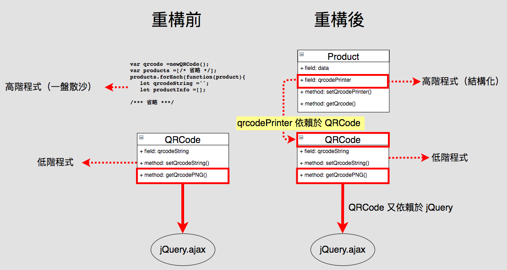

# 測試的術語
## 2. 高階與低階（Hight-level and low-level）

> 高階與低階一詞在程式的世界中很常見，越高階的程式碼越抽象，越低階的程式碼越多實作。

第一次看到這句話的人可能已經開始神遊，不過現在讓哥帶你釐清如何辨別高階與低階。

 註：**「高階」也常以 「Client」 一詞做取代**。


### 低階程式

首先來看低階程式碼，越低階的程式碼越接近底層。一般來說我們都懂，**越底層的程式碼越複雜**，這是因為物件導向開發傾**封裝複雜的過程**，以便重複利用。

這個概念其實在開發過程中也常碰到，以 jQuery 的 ajax 作舉例，你知道 jQuery 在封裝 ajax 之前有多複雜嗎？？

在 [ajax 沒有被封裝之前，程式碼長這樣](https://github.com/jquery/jquery/blob/1.7/src/ajax.js#L383-L764)：

```javascript
// If url is an object, simulate pre-1.5 signature
if (typeof url === "object") {
    options = url;
    url = undefined;
}

// Force options to be an object
options = options || {};

var // Create the final options object
s = jQuery.ajaxSetup({}, options),
// Callbacks context
callbackContext = s.context || s,
var // Create the final options object
s = jQuery.ajaxSetup({}, options),
// Callbacks context
callbackContext = s.context || s,
// Context for global events
// It's the callbackContext if one was provided in the options
// and if it's a DOM node or a jQuery collection
globalEventContext = callbackContext !== s &&
( callbackContext.nodeType || callbackContext instanceof jQuery ) ?
    jQuery(callbackContext) : jQuery.event,
// Deferreds
deferred = jQuery.Deferred(),
completeDeferred = jQuery.Callbacks("once memory"),
// Status-dependent callbacks
statusCode = s.statusCode || {},
// ifModified key
ifModifiedKey,
// Headers (they are sent all at once)
requestHeaders = {},
    
/**
 *  ajax 全長有 380 行程式碼，故省略。
 **/ 
```

這些程式碼，全部都是「實作」`非同步連線`功能的程式碼。如果每次要使用`非同步連線`功能都要寫 380 行程式碼，那真的會瘋掉。

為了避免這種情況，

> 物件導向開發會將這些複雜的「實作」封裝起來，變成一個「抽象」的概念。

如 jQuery 把`非同步連線`功能的「實作程式碼」封裝成 jQuery.ajax 方法：

```javascript

// 封裝實作後，只需要呼叫「抽象」的 ajax 方法即可使用非同步連線功能，舒服！
$.ajax({
    method: "POST",
    url: "register.php",
    data: {name: "John", location: "Boston"}
}).done(function (msg) {
    alert("Data Saved: " + msg);
});
```

### 高階

有了把實作「抽象化」的概念後，接著可以來認識一下「高階」程式碼。

假設今天需求要將商品資訊列印成 QRCode，並且要發送 QRCode 線上服務 API 才能產生並取回 QRCode 圖檔。

這時候就可以使用 jQuery.ajax 來達成。

首先我們可以建立一個 QRCode 物件，並且使用 jQuery.ajax 替我們發送 API 給 QRCode 線上服務：

```javascript
QRCode = function() {
    this.qrcodeString = null;
};

QRCode.prototype.setQrcodeString = function(qrcodeString) {
    this.qrcodeString = qrcodeString;
};

QRCode.prototype.getQrcodePNG = function(callback) {
    
    // 依賴 jQuery.ajax
    $.ajax({
        method: "GET",
        url: "https:www.qr-code-generator.com/a/generator.php",
        data: {
            text: this.qrcodeString;
        }
    }).done(function (data) {
        callback(data);
    });
};
```

如範例可見 QRCode 這個類別，依賴於 jQuery.ajax，這就已經產生一個高階與低階的關係：


現在 QRCode 只要透過 getQRCodePNG 這個抽象方法，就可以取得 QRCode 圖檔了！

### 更高階的程式

目前只有 QRCode 類別，還沒有辦法列印商品資料，所以我們要寫一些來讓程式可以印出商品資訊：

```javascript

var qrcode = new QRCode();

var products = [ /* 省略 */];

products.forEach(function(product) {

    let qrcodeString = '';
    let productInfo = [];
    productInfo.push(product['id']);
    productInfo.push(product['name']);
    productInfo.push(product['price']);
    productInfo.push(product['createTime']);

    qrcodeString = productInfo.join(';');
     
    // 依賴於 QRCode 類別
    qrcode.setQrcodeString(qrcodeString);
    
    qrcode.getQrcodePNG(function(png) {
        let image = document.create('img', {
            src:png
        });
        document.body.append(image);
    });
});
```

如範例，這一段列印 QRCode 的程式碼依賴於 QRCode 物件，那麼這段程式碼也就成為高階程式，而 QRCode 物件也變成低階程式（被依賴）。

這種高階與低階的關係，會在物件導向的程式碼中環環相扣，最後造成了「**越高階就越抽象，越低階就越多實作**」的現象。

雖然現在已經可以列印圖片的 QRCode，但我們仍可將這段程式碼重構一下，讓程式碼之間的關係更清楚：
```javascript
Product = function(data) {
    this.data = data;
    this.qrcodePrinter = null;
};

/**
 * 透過依賴注入的方式，把 QRCode 物件注入到 Product 裡面。
 * 
 * 供取得 QRCode 方法使用。
 * 
 * @param QRCode qrcodePrinter
 */
Product.prototype.setQrcodePrinter = function(qrcodePrinter) {
    this.qrcodePrinter = qrcodePrinter;
};

Product.prototype.getQrcode = function(callback) {

    qrcodeString = '';
    productInfo = [];
    productInfo.push(this.data['id']);
    productInfo.push(this.data['name']);
    productInfo.push(this.data['price']);
    productInfo.push(this.data['createTime']);

    qrcodeString = productInfo.join(';');
    // 依賴 jQuery.ajax
    this.qrcodePrinter.setQrcodeString(qrcodeString);
    this.qrcodePrinter.getQrcodePNG(callback);
};


/*******************************
* 重構後的程式碼
*******************************/

var qrcode = new Qrcode();

var products = [ /* 省略 */];

products.forEach(function(product) {
    
    let productObj = new Product(product);
   
    // 依賴注入
    productObj.setQrcodePrinter(qrcode);
    
    productObj.getQrcode(function(png) {
       image = document.create('img', {
           src:png
       });
       document.body.append(image);
   });
});
```

比對一下重構前跟重構後的關係圖：



### 總結：

  * 在測試中也可以是摡括性的（高階）或更加深入細節的（低階）。
  * 在測試中高階一詞大致對應到「整合測試」、「端對端測試」，而低階則對應到「單元測試」(Unit tests）。

參考資料：

[Test Cases - High Level Vs Low level Test Cases](https://huddle.eurostarsoftwaretesting.com/writing-test-cases-high-level-test-cases-vs-low-level-test-cases/)


